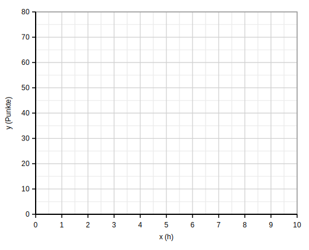

## 1. Lernziel

Ich kann

- ein lineares Regressionsmodell **grafisch darstellen**,
- den **Mean Squared Error (MSE)** von Hand berechnen,
- und **Modelle vergleichen** (welches passt besser?).

## 2. Was bedeutet $y$ und $\hat{y}$?

- **$y$**: tatsächlicher (gemessener) Wert aus den Daten  
  Beispiel: die wirklich erreichte Punktzahl im Test.

- **$\hat{y}$** („y-Dach“): vom **Modell vorhergesagter Wert**  
  Das ist der Wert, den die Regressionsgerade für ein bestimmtes $x$ liefert.

Der Fehler (Residual) eines Punkts ist:

$$
y - \hat{y}
$$

## 3. Mean Squared Error (MSE)

Der **Mean Squared Error** ist der Durchschnitt der **quadrierten** Fehler:

$$
\mathrm{MSE} = \frac{1}{n}\sum_{i=1}^{n}(y_i - \hat{y}_i)^2
$$

**Merke:** Je kleiner der MSE, desto besser passt das Modell zu den Daten.

\newpage

# Beispiel 1: Lernzeit und Testresultat

Gegeben ist das lineare Modell:

$$
\hat{y} = 10x + 30
$$

### Datenpunkte

| Lernzeit $x$ (h) | Tatsächliche Punkte $y$ |
|---:|---:|
| 0 | 32 |
| 1 | 42 |
| 2 | 48 |
| 3 | 65 |
| 4 | 68 |
| 5 | 79 |

## Aufgabe 1a: Zeichnen

1. Trage die Punkte $(x,y)$ in das Koordinatensystem ein.
2. Zeichne die Gerade $\hat{y} = 10x + 30$.
3. Markiere bei **mindestens zwei Punkten** den vertikalen Abstand zur Geraden (das ist der Fehler $y-\hat{y}$).

## Aufgabe 1b: MSE berechnen (von Hand)

Fülle die Tabelle aus:

| $x$ | $y$ | $\hat{y}$ | $y-\hat{y}$ | $(y-\hat{y})^2$ |
|---:|---:|---:|---:|---:|
| 0 | 32 |  |  |  |
| 1 | 42 |  |  |  |
| 2 | 48 |  |  |  |
| 3 | 65 |  |  |  |
| 4 | 68 |  |  |  |
| 5 | 79 |  |  |  |

**MSE =** 

\newpage

# Beispiel 2: Zwei Modelle vergleichen

Gegeben sind dieselben Datenpunkte:

| $x$ | $y$ |
|---:|---:|
| 0 | 30 |
| 1 | 40 |
| 2 | 50 |
| 3 | 60 |
| 4 | 70 |
| 5 | 80 |

### Modelle

- **Modell A:** $\hat{y}_A = 8x + 35$
- **Modell B:** $\hat{y}_B = 10x + 30$

## Aufgabe 2a: Zeichnen

1. Trage die Punkte $(x,y)$ ein.
2. Zeichne **beide** Geraden (A und B) ins gleiche Koordinatensystem.
3. Entscheide **visuell**, welche Gerade besser passt (kurz begründen).

\newpage

## Aufgabe 2b: MSE für Modell A

| $x$ | $y$ | $\hat{y}_A$ | $y-\hat{y}_A$ | $(y-\hat{y}_A)^2$ |
|---:|---:|---:|---:|---:|
| 0 | 30 |  |  |  |
| 1 | 40 |  |  |  |
| 2 | 50 |  |  |  |
| 3 | 60 |  |  |  |
| 4 | 70 |  |  |  |
| 5 | 80 |  |  |  |

**MSE\_A =**

\newpage

## Aufgabe 2c: MSE für Modell B

| $x$ | $y$ | $\hat{y}_B$ | $y-\hat{y}_B$ | $(y-\hat{y}_B)^2$ |
|---:|---:|---:|---:|---:|
| 0 | 30 |  |  |  |
| 1 | 40 |  |  |  |
| 2 | 50 |  |  |  |
| 3 | 60 |  |  |  |
| 4 | 70 |  |  |  |
| 5 | 80 |  |  |  |

**MSE\_B =**

\newpage

## Aufgabe 2d: Interpretation (2–4 Sätze)

1. Welches Modell hat den **kleineren MSE**?
2. Passt das zu deinem **grafischen Eindruck**? Warum?

