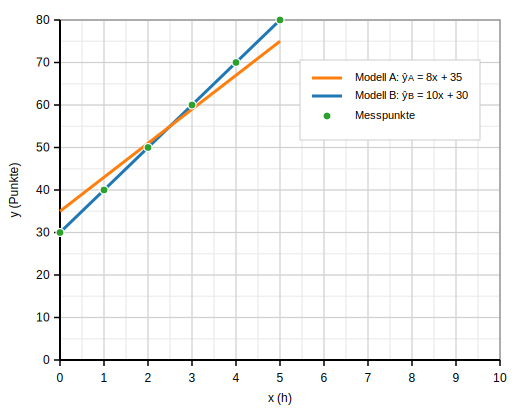

# Beispiel 1: Lernzeit und Testresultat

Modell: $\hat{y} = 10x + 30$

## Ausgefüllte Tabelle

| $x$ | $y$ | $\hat{y}$ | $y-\hat{y}$ | $(y-\hat{y})^2$ |
|---:|---:|---:|---:|---:|
| 0 | 32 | 30 | 2  | 4  |
| 1 | 42 | 40 | 2  | 4  |
| 2 | 48 | 50 | -2 | 4  |
| 3 | 65 | 60 | 5  | 25 |
| 4 | 68 | 70 | -2 | 4  |
| 5 | 79 | 80 | -1 | 1  |

$$
	ext{SSE} = 4+4+4+25+4+1 = 42, \qquad \text{MSE} = \frac{42}{6} = 7
$$

Interpretation: Durchschnittlich liegt die Vorhersage um etwa
$\sqrt{7}\approx2.6$ Punkte daneben.

Visualisierung (Gerade $\hat{y}=10x+30$ mit Messpunkten):

{ width=80% }

\newpage

# Beispiel 2: Zwei Modelle vergleichen

Wir nutzen die gleichen Messwerte wie im Modell B, damit der
Unterschied klar wird.

Datenpunkte: $(x,y) = (0,30),(1,40),(2,50),(3,60),(4,70),(5,80)$

## Modell A: $\hat{y}_A = 8x + 35$

| $x$ | $y$ | $\hat{y}_A$ | $y-\hat{y}_A$ | $(y-\hat{y}_A)^2$ |
|---:|---:|---:|---:|---:|
| 0 | 30 | 35 | -5 | 25 |
| 1 | 40 | 43 | -3 | 9  |
| 2 | 50 | 51 | -1 | 1  |
| 3 | 60 | 59 | 1  | 1  |
| 4 | 70 | 67 | 3  | 9  |
| 5 | 80 | 75 | 5  | 25 |

$$
    ext{SSE}_A = 70, \qquad \text{MSE}_A = \frac{70}{6} \approx 11.67
$$

## Modell B: $\hat{y}_B = 10x + 30$

| $x$ | $y$ | $\hat{y}_B$ | $y-\hat{y}_B$ | $(y-\hat{y}_B)^2$ |
|---:|---:|---:|---:|---:|
| 0 | 30 | 30 | 0 | 0 |
| 1 | 40 | 40 | 0 | 0 |
| 2 | 50 | 50 | 0 | 0 |
| 3 | 60 | 60 | 0 | 0 |
| 4 | 70 | 70 | 0 | 0 |
| 5 | 80 | 80 | 0 | 0 |

$$
    ext{SSE}_B = 0, \qquad \text{MSE}_B = \frac{0}{6} = 0
$$

Visualisierung der beiden Modelle (A in Orange, B in Blau) mit Datenpunkten (Grün):

{ width=80% }

## Interpretation

1.   **$\mathrm{MSE}_B < \mathrm{MSE}_A$**, Modell B passt perfekt auf
    die Daten.
2.   Grafisch liegen alle Punkte auf der Geraden von Modell B, daher MSE
    = 0.
