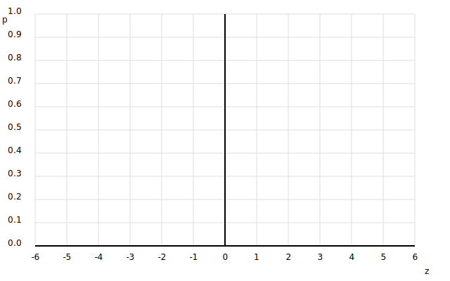

# Einleitung

## 1. Lernziel
Ich kann

- den Zweck der logistischen Regression erklären (Ja/Nein-Vorhersage)
- die Sigmoid-Funktion anwenden, um eine Wahrscheinlichkeit zu berechnen
- Klassen vorhersagen und einfache Metriken (Accuracy) interpretieren

## 2. Was macht die logistische Regression?
- Sie berechnet aus den Eingaben einen **Rohscore** $z$ (eine Zahl kann negativ, null oder positiv sein), oft mit einer einfachen linearen Formel, z. B. $z = a\,x + b$.
- Erst mit der **Sigmoid-Funktion** wird daraus eine Wahrscheinlichkeit $p \in (0,1)$:

$$
\sigma(z) = \frac{1}{1 + e^{-z}}
$$

- **Entscheidungsgrenze:** $p = 0.5$ entspricht $z = 0$; mit mehreren Features ist das eine Linie/Ebene zwischen den Klassen.
- **Typische Regel:** $\hat{y}=1$ falls $p \ge 0.5$, sonst $\hat{y}=0$.
- **Schwelle anpassbar:** Höhere Schwelle = strenger, niedrigere Schwelle = grosszügiger.

## 3. Mini-Übung: Sigmoid skizzieren
- Zeichne die Kurve von $\sigma(z)$ für $z \in [-6,6]$ in das Gitter unten.
- Markiere diese Punkte (gerundet):
	- $(-6, \approx0.002)$, $(-4, \approx0.018)$, $(-3, \approx0.047)$, $(-2, \approx0.119)$, $(-1, \approx0.269)$
	- $(0, 0.5)$, $(1, \approx0.731)$, $(2, \approx0.881)$, $(3, \approx0.953)$, $(4, \approx0.982)$, $(6, \approx0.998)$
- Zeige, dass die Kurve bei $0.5$ „umkippt“ und sich bei 0 bzw. 1 asymptotisch annähert.

\clearpage

# Beispiel 1: Besteht man den Test?

Gegebenes Modell (aus Training gelernt):

$$
p = \sigma(1.2\,x - 2.0)
$$

*Interpretation:* $x$ = Lernzeit in Stunden, $p$ = Wahrscheinlichkeit, den Test zu bestehen (Klasse 1).

## Datenpunkte

| Lernzeit $x$ (h) | Tatsächliches Label $y$ (0 = nicht bestanden, 1 = bestanden) |
|---:|---:|
| 0.5 | 0 |
| 1.0 | 0 |
| 1.5 | 0 |
| 2.0 | 0 |
| 2.5 | 1 |
| 3.0 | 1 |

## Aufgabe 1a: Wahrscheinlichkeiten berechnen
Fülle die Tabelle aus (Zwischenschritte runden auf 3 Nachkommastellen):

| $x$ | $z = 1.2x - 2.0$ | $p = \sigma(z)$ | $\hat{y}$ (Schwelle 0.5) |
|---:|---:|---:|---:|
| 0.5 |   |   |   |
| 1.0 |   |   |   |
| 1.5 |   |   |   |
| 2.0 |   |   |   |
| 2.5 |   |   |   |
| 3.0 |   |   |   |

## Aufgabe 1b: Accuracy bestimmen
- Trage $\hat{y}$ aus der Tabelle ein und vergleiche mit $y$.
- Zähle die **korrekt** klassifizierten Beispiele.
- **Accuracy = (korrekte Vorhersagen) / (Anzahl Beispiele)**.

**Accuracy =**

\newpage

# Beispiel 2: Zwei Modelle vergleichen

Gleiche Datenpunkte wie oben.

## Modelle
- **Modell A:** $p_A = \sigma(1.0\,x - 1.8)$
- **Modell B:** $p_B = \sigma(1.4\,x - 2.9)$

## Aufgabe 2a: Wahrscheinlichkeiten & Klassen
Berechne für beide Modelle $p$ und $\hat{y}$ (Schwelle 0.5) und fülle die Tabellen.

**Modell A**

| $x$ | $y$ | $z_A = 1.0x - 1.8$ | $p_A$ | $\hat{y}_A$ |
|---:|---:|---:|---:|---:|
| 0.5 | 0 |   |   |   |
| 1.0 | 0 |   |   |   |
| 1.5 | 0 |   |   |   |
| 2.0 | 0 |   |   |   |
| 2.5 | 1 |   |   |   |
| 3.0 | 1 |   |   |   |

**Modell B**

| $x$ | $y$ | $z_B = 1.4x - 2.9$ | $p_B$ | $\hat{y}_B$ |
|---:|---:|---:|---:|---:|
| 0.5 | 0 |   |   |   |
| 1.0 | 0 |   |   |   |
| 1.5 | 0 |   |   |   |
| 2.0 | 0 |   |   |   |
| 2.5 | 1 |   |   |   |
| 3.0 | 1 |   |   |   |

## Aufgabe 2b: Accuracy vergleichen
- Berechne die Accuracy von Modell A und B.
- Welches Modell ist besser? Gibt es Punkte, die ein Modell richtig und das andere falsch hat?

**Accuracy A =**

\vspace{1cm}

**Accuracy B =** 

\vspace{1cm}

## Aufgabe 2c: Kurze Interpretation (2–4 Sätze)
- Welches Modell würdest du wählen und warum?
- Wie könnte man die Schwelle 0.5 verändern, um mehr/ weniger False Positives zu bekommen?

\newpage

# Reflexion
- In welchen Situationen ist die logistische Regression besser geeignet als die lineare Regression?
- Warum sind Wahrscheinlichkeiten hilfreicher als nur harte 0/1-Entscheidungen?
