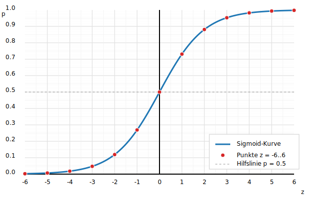

# Lösung Mini-Übung: Sigmoid skizzieren

Gerundete Werte für $\sigma(z)$ bei ganzzahligen $z \in [-6,6]$ (auf 3 Nachkommastellen):

| $z$ | $\sigma(z)$ (gerundet) |
|---:|---:|
| -6 | 0.002 |
| -5 | 0.007 |
| -4 | 0.018 |
| -3 | 0.047 |
| -2 | 0.119 |
| -1 | 0.269 |
| 0  | 0.500 |
| 1  | 0.731 |
| 2  | 0.881 |
| 3  | 0.953 |
| 4  | 0.982 |
| 5  | 0.993 |
| 6  | 0.998 |

Die Kurve kippt bei $p=0.5$ (entspricht $z=0$) und nähert sich 0 bzw. 1 asymptotisch an.

Graphische Lösung auf dem Koordinatengitter (blaue Sigmoid-Kurve, rote Punkte bei $z=-6..6$):

# Beispiel 1: Besteht man den Test?

Gegeben: $p = \sigma(1.2\,x - 2.0)$

## Lösung Aufgabe 1a

Berechnungen (gerundet auf 3 Nachkommastellen):

| $x$ | $z = 1.2x - 2.0$ | $p = \sigma(z)$ | $\hat{y}$ (Schwelle 0.5) |
|---:|---:|---:|---:|
| 0.5 | -1.400 | 0.198 | 0 |
| 1.0 | -0.800 | 0.310 | 0 |
| 1.5 | -0.200 | 0.450 | 0 |
| 2.0 | 0.400 | 0.599 | 1 |
| 2.5 | 1.000 | 0.731 | 1 |
| 3.0 | 1.600 | 0.832 | 1 |

## Lösung Aufgabe 1b (Accuracy)

Ist-Labels: $[0,0,0,0,1,1]$  
Vorhersagen: $[0,0,0,1,1,1]$

Korrekte: 5 von 6  
**Accuracy = $5/6 \approx 0.833$ (83.3\%)**

Hinweis: Bei $x=2.0$ lag die Schwelle knapp daneben → Fehlklassifikation.

\newpage

# Beispiel 2: Zwei Modelle vergleichen

Daten: $(x,y) = (0.5,0),(1.0,0),(1.5,0),(2.0,0),(2.5,1),(3.0,1)$

## Modell A: $p_A = \sigma(1.0\,x - 1.8)$

| $x$ | $y$ | $z_A$ | $p_A$ | $\hat{y}_A$ |
|---:|---:|---:|---:|---:|
| 0.5 | 0 | -1.300 | 0.214 | 0 |
| 1.0 | 0 | -0.800 | 0.310 | 0 |
| 1.5 | 0 | -0.300 | 0.426 | 0 |
| 2.0 | 0 | 0.200  | 0.550 | 1 |
| 2.5 | 1 | 0.700  | 0.668 | 1 |
| 3.0 | 1 | 1.200  | 0.769 | 1 |

Korrekte: 5/6  
**Accuracy A = $5/6 \approx 0.833$**

## Modell B: $p_B = \sigma(1.4\,x - 2.9)$

| $x$ | $y$ | $z_B$ | $p_B$ | $\hat{y}_B$ |
|---:|---:|---:|---:|---:|
| 0.5 | 0 | -2.200 | 0.099 | 0 |
| 1.0 | 0 | -1.500 | 0.182 | 0 |
| 1.5 | 0 | -0.800 | 0.310 | 0 |
| 2.0 | 0 | -0.100 | 0.475 | 0 |
| 2.5 | 1 | 0.600  | 0.646 | 1 |
| 3.0 | 1 | 1.300  | 0.786 | 1 |

Korrekte: 6/6  
**Accuracy B = $6/6 = 1.0$**

## Interpretation
1. Modell B ist besser: 1.0 Accuracy vs. 0.833 bei Modell A. B klassifiziert auch den Grenzfall $x=2.0$ korrekt als 0.
2. B ist steiler und liefert höhere Wahrscheinlichkeiten für die positiven Beispiele (2.5, 3.0) und niedrigere für die negativen (0.5, 1.0, 1.5, 2.0).

## Visualisierung der Modelle A und B

Die Grafik zeigt beide Sigmoid-Kurven ($p_A = \sigma(1.0x - 1.8)$ in Blau, $p_B = \sigma(2.0x - 4.2)$ in Orange) sowie die Trainingspunkte farblich nach Klasse (grau = nicht bestanden, grün = bestanden) im Bereich $x \in [-8,8]$.

# Reflexion (Musterantwort)
1. Accuracy kann irreführend sein, wenn Klassen stark unausgeglichen sind (z. B. 99% Klasse 0). Dann kann ein triviales Modell „immer 0“ hohe Accuracy haben, aber nichts Nützliches lernen.
2. Wahrscheinlichkeiten sind hilfreicher als harte 0/1-Labels, weil sie Unsicherheit zeigen: Man kann Schwellen anpassen und Entscheidungen (False Positives, False Negatives) besser steuern.