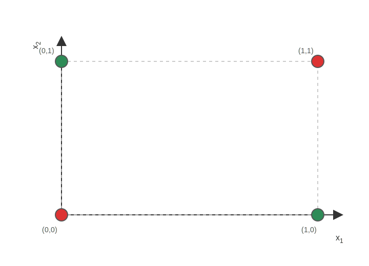

## Einleitung: Warum braucht man mehr als ein Perzeptron?

Ein einzelnes Perzeptron (Neuron) kann nur lineare Entscheidungsgrenzen lernen – also **eine** Trennlinie im 2D-Raum (eine Gerade). Sobald die Daten jedoch nicht linear trennbar sind, wie beim XOR-Problem, kommt ein einzelnes Perzeptron an seine Grenzen. Die Lösung dieses Problems ist die Kombination von einzelnen Perzeptronen in mehreren Schichten. In diesem Arbeitsblatt geht es darum, **wie** ein mehrschichtiges Netz das Problem „in Zwischenschritten“ lösen kann.

## 2. Lernziel

Ich kann

- den Aufbau eines mehrschichtigen neuronalen Netzes beschreiben (Schichten, Gewichte, Bias),
- erklären, warum eine versteckte Schicht „mehr als eine Trennlinie“ möglich macht,
- einen einfachen Vorwärtsdurchlauf mit Step-Funktion rechnen (wie beim Perzeptron),
- Backpropagation als Idee erklären: *Fehler zurückgeben und Gewichte leicht korrigieren*.
- einfache Fehlerkorrektur-Updates in der Output-Schicht durchführen.

\newpage

## 3. Mehrschichtiges Netz (versteckte Schicht) als „Zwischenschritt-Maschine"

Ein **mehrschichtiges** Netz besteht aus mehreren Perzeptron-ähnlichen Bausteinen hintereinander. Dadurch kann es **mehrere Regionen** im Koordinatensystem bilden. In der Grafik sieht man ein einfaches mehrschichtiges Netz mit einer versteckten Schicht. In der versteckten Schicht können mehrere Neuronen jeweils eigene Trennlinien lernen, die zusammen komplexere Entscheidungsgrenzen ermöglichen. In unserem Beispiel sind 2 Neuronen in der versteckten Schicht dargestellt, die jeweils unterschiedliche Trennlinien lernen können. Neben den Eingangsgewichten gibt es auch Bias-Gewichte, die wie ein zusätzlicher fester Eingang „1“ wirken. In der Output-Schicht wird dann aus den Ausgaben der versteckten Schicht eine finale Entscheidung getroffen. Die Aktivierungsfunktion (z.B. Step-Funktion) sorgt dafür, dass das Netz nicht nur lineare Kombinationen lernt, sondern auch komplexere Muster erkennen kann. Die Anzahl Gewichte im Netz hängt von der Anzahl Neuronen und Schichten ab, da jede Verbindung (Kante) im Netz ein eigenes Gewicht hat. Somit erhöht sich die Anzahl der Gwichte von ursprünglich 3 im Perzeptron auf insgesamt 9 (6 in die versteckte Schicht und 3 in die Output-Schicht, inklusive Bias-Gewichte).

{ width=100% fig-pos="H" }

### 3.1 Was ist neu gegenüber dem Perzeptron?

- Beim Perzeptron gibt es **einen** Rechenschritt: Eingaben → Output.
- Beim Mehrschichtnetz gibt es **Zwischenschritte**: Eingaben → versteckte Schicht → Output.
- Jedes Neuron rechnet im Prinzip wie ein Perzeptron: *gewichtete Summe + Bias → Aktivierung*.

### 3.2 Vorwärtsdurchlauf - Wie macht das Netz eine Vorhersage?

So rechnet man einen Vorwärtsdurchlauf respektive eine Vorhersage $\hat{y}$:

1. Für jedes Neuron in der versteckten Schicht: Gewichtete Summe bilden (Bias zählt wie ein extra Eingang „1“).
2. Aktivierung anwenden (für unsere Aufgaben nutzen wir wieder die Step-Funktion wie beim Perzeptron).
3. Die Ausgaben der versteckten Schicht sind die neuen „Eingänge" fürs Output-Neuron.
4. Output-Neuron rechnet genauso: Gewichtete Summe → Aktivierung (Step-Funktion).
5. Ergebnis ist die Vorhersage $\hat{y}$ des Netzes mit 0 oder 1.

Die gewichtete Summe ist analog zum Perzeptron, nur ist jetzt der Eingang $x$ die Ausgabe des jeweiligen Neurons in der versteckten Schicht. Für ein Neuron in der versteckten Schicht sieht die Rechnung so aus:

$$
z = w_0\cdot 1 + w_1x_1 + w_2x_2
$$

Danach wird die Aktivierungsfunktion angewendet (Step-Funktion):

$$
h = g(z) = \begin{cases}1,& z \ge 0\\ 0,& z < 0\end{cases}
$$

Zwischen der versteckten Schicht und der Output-Schicht gibt es ebenfalls Gewichte und einen Bias. Das Output-Neuron kombiniert die Ausgaben der versteckten Schicht, um die finale Vorhersage zu treffen. die Formeln sind die gleichen wie oben, einfach mit den Ausgaben der versteckten Schicht als Eingänge:

$$
z_{output} = v_0\cdot 1 + v_1h_1 + v_2h_2
$$

$$
\hat{y} = g(z_{output}) = \begin{cases}1,& z_{output} \ge 0\\ 0,& z_{output} < 0\end{cases}
$$

### 3.3 Aufgabe: Netz-Aufbau

1) Wie viele Neuronen sind in der versteckten Schicht?
2) Wie viele Verbindungen (Pfeile) mit Bias führen **in die Versteckte Schicht** hinein?
3) Wie viele Verbindungen (Pfeile) mit Bias führen **in die Output-Schicht** hinein?
4) Wie viele Gewichte gibt es insgesamt im Netz?
5) Wie viele Gewichte gibt es ingesamt, wenn man 3 Neuronen in der versteckten Schicht hätte?
6) Wie viel Gewichte gibt es insgesamt, wenn man n Neuronen in der versteckten Schicht hätte?
7) Erkläre in 1–2 Sätzen: Wieso bedeutet „mehr Schichten“ nicht automatisch „besser“, wenn man keine Aktivierung dazwischen hätte?

\newpage

## 4. XOR mit versteckter Schicht

Wir versuchen nun nachfolgend das XOR-Gatter mit einer versteckten Schicht zu bauen. Dabei verwenden wir drei Perzeptron-ähnliche Neuronen. Die zwei Neuronen in der versteckten Schicht bereiten jeweils einenen Zwischenschritt vor, die das Output-Neuron dann kombiniert, um XOR zu realisieren.

- Neuron der versteckten Schicht $h_1$ macht **OR**
- Neuron der versteckten Schicht $h_2$ macht **NAND**
- Output macht **AND** von $h_1$ und $h_2$

Die wichtigste Beobachtung:

- Mit **nur einem** Perzeptron geht es nicht.
- Mit **zwei** Neuronen in der versteckten Schicht kann man zwei hilfreiche Zwischenergebnisse bilden.

{ fig-pos="H" }

### 4.1 Aufgabe: XOR-Tabelle ausfüllen

Fülle die Tabelle aus. Dabei verwendet man die logischen Funktionen OR, NAND und AND. NAND bedeutet hier „NOT AND“ und ist das Gegenteil von AND.

| $x_1$ | $x_2$ | $h_1=\mathrm{OR}(x_1,x_2)$ | $h_2=\mathrm{NAND}(x_1,x_2)$ | $\hat{y}=\mathrm{AND}(h_1,h_2)$ |
|---:|---:|---:|---:|---:|
| 0 | 0 |  |  |  |
| 0 | 1 |  |  |  |
| 1 | 0 |  |  |  |
| 1 | 1 |  |  |  |

### 4.2 Aufgabe: Visualisierung XOR-Gatter mit Trennlinien

Die Neuronen der versteckten Schicht kann man sich als **zwei Trennlinien** vorstellen:

- OR trennt den Punkt (0,0) von den anderen.
- NAND trennt den Punkt (1,1) von den anderen.

Wenn man **beide** Bedingungen gleichzeitig nimmt (OR=1 **und** NAND=1), bleiben genau die beiden XOR-1-Punkte übrig.

\newpage

**Aufgabe:**

1) Zeichne die **OR-Trennlinie** ins Gitter und beschrifte sie mit: „OR / Neuron $h_1$“.
2) Zeichne die **NAND-Trennlinie** ins Gitter und beschrifte sie mit: „NAND / Neuron $h_2$“.
3) Markiere (z.B. schraffieren) die Region, in der **beide** gelten: OR=1 und NAND=1.
4) Erkläre in 2–3 Sätzen, was die beiden Neuronen der versteckten Schicht „für“ das Output-Neuron vorbereiten.
5) Anstatt AND im Output könnte man auch OR verwenden. Welche Ausgaben wären dann für die 4 Eingabekombinationen möglich? Wäre das ein sinnvolles logisches Gatter?

{ fig-pos="H" }

\newpage

## 5. Backpropagation: Wie lernt das Netz?

Die Aufgabe 4 hat gezeigt, wie man XOR mit einem mehrschichtigen Netz lösen kann. Normalerweise würde das Netz seine Gewichte jedoch **lernen** müssen, anstatt sie mithilfe von bestehenden Logik Gattern zu „konstruieren“. Die in unserem Netzwerk vorhandenen 9 Gewichte werden wähnend dem Lernprozess so angepasst, dass die Vorhersagen $\hat{y}$ möglichst gut zu den Zielwerten $y$ passen. Dies geschieht durch einen Prozess namens **Backpropagation** (Rückwärtsausbreitung des Fehlers).

### 5.1 Aufgabe: Welche Gewichte ändern sich wie?

Wichtig: Für das **Entscheiden** kann man am Ende eine Step-Funktion nutzen (0 oder 1).
Beim **Lernen** nutzt man aber (wie bei der **logistischen Regression**) eine Aktivierungsfunktion, die eine **Wahrscheinlichkeit** liefert:
$\hat{y}\in[0,1]$.

Dann ergibt „zu klein / zu gross“ sofort Sinn: $\hat{y}=0.73$ bedeutet z.B. „73% Wahrscheinlichkeit für Klasse 1“.
Erst ganz am Ende kann man daraus wieder eine 0/1-Entscheidung machen (z.B. mit einer Schwelle bei 0.5). Siehe auch das Arbeitsblatt zur logistischen Regression.

In der Abbildung 1 sind folgende Gewichte eingezeichnet:

| Gewicht | Verbindung | Bedeutung |
|---|---|---|
| $w_0$ | $1 \rightarrow h_1$ | Bias-Gewicht des Neurons $h_1$ |
| $w_1$ | $1 \rightarrow h_2$ | Bias-Gewicht des Neurons $h_2$ |
| $w_2$ | $x_1 \rightarrow h_1$ | Eingang $x_1$ in das Neuron $h_1$ |
| $w_3$ | $x_1 \rightarrow h_2$ | Eingang $x_1$ in das Neuron $h_2$ |
| $w_4$ | $x_2 \rightarrow h_1$ | Eingang $x_2$ in das Neuron $h_1$ |
| $w_5$ | $x_2 \rightarrow h_2$ | Eingang $x_2$ in das Neuron $h_2$ |
| $v_0$ | $1 \rightarrow y$ | Bias-Gewicht des Output-Neurons |
| $v_1$ | $h_1 \rightarrow y$ | Beitrag von $h_1$ zur Ausgabe |
| $v_2$ | $h_2 \rightarrow y$ | Beitrag von $h_2$ zur Ausgabe |

**Aufgabe:**

1) **Richtung der Änderung:** Angenommen $y=1$ und das Netz gibt einen *zu kleinen* Wert $\hat{y}$ aus (also Fehler $y-\hat{y}>0$).
	- Sollen $v_0,v_1,v_2$ eher **grösser** oder eher **kleiner** werden, damit $\hat{y}$ steigt?

2) **Wer ändert sich stärker?** Stell dir vor, $h_1$ ist grösser als $h_2$ (z.B. $h_1\approx 0.62$ und $h_2\approx 0.38$).
	- Welches Gewicht wird bei der *gleichen* Korrektur-Regel stärker verändert: $v_1$ oder $v_2$?
	- Begründe mit einem Satz.

3) **Was ist mit den Gewichten der versteckten Schicht?** Überlege dir in einem Satz, wie die Gewichte $w_0,w_1,w_2,w_3,w_4,w_5$ angepasst werden könnten, damit die Vorhersage $\hat{y}$ besser wird.

\newpage

### 5.2 Idee von Backpropagation
Beim Lernen passt das Netz seine Gewichte an, um die Vorhersage $\hat{y}$ zu verbessern. So kann man sich das Lernen vorstellen:

1) Vorwärts rechnen: Netz gibt eine Vorhersage $\hat{y}$ aus.
2) Fehler bestimmen: *Ziel minus Vorhersage*.
3) Rückwärts: Gewichte, die stark „mitgeholfen“ haben, werden ein kleines Stück angepasst.

Wir nennen den Fehler hier einfach:

- Fehler = $y-\hat{y}$

Wenn der Fehler positiv ist, war die Vorhersage zu klein (wir wollen $\hat{y}$ erhöhen). Wenn er negativ ist, war sie zu gross.

**Verständnisfragen:**

1) **Vorwärts vs. rückwärts:** Was fliesst im Vorwärtsdurchlauf durch das Netz (welche Grössen), und was fliesst beim „Rückwärts“-Teil zurück?
2) **Fehler-Interpretation:** Was bedeutet ein positiver Fehler $e=y-\hat{y}>0$ in Worten? Was bedeutet ein negativer Fehler?
3) **Wenn der Fehler 0 ist:** Was passiert mit den Gewichten, wenn $e=0$? Begründe kurz.
4) **Warum überhaupt rückwärts?** Warum reicht es oft nicht, nur die Output-Gewichte $v_0,v_1,v_2$ zu verändern, wenn die versteckte Schicht „schlechte“ Zwischenergebnisse liefert?

\newpage

### 5.3 Aufgabe - Fehler mehrschichtigen Netz berechnen

Wir machen **ein** Update nur in der Output-Schicht – Analog zum Perzeptron-Update. Da $\hat{y}$ eine Wahrscheinlichkeit ist, nehmen wir einen **kleinen Teil** des Fehlers, um die Gewichte anzupassen. Das sorgt für stabileres Lernen. In diesem Beispiel verwenden wir eine Lernrate von $\eta = 0.2$. Konsultiere das Arbeitsblatt Perzeptron für eine ähnliche Update-Regel und Erklärung der Lernrate.

Update-Regel (für diese Übung):

- Für jedes Gewicht $v_i$ in der Output-Schicht gilt:
    $$
    v_i = v_i + \eta \, (y - \hat{y})\, x_i
    $$

**Folgende Parameter sind gegeben:**

| Grösse | Wert | Kurzinfo |
|---|---:|---|
| Ziel | $y=1$ | Klasse 1 |
| Vorhersage | $\hat{y}\approx 0.73$ | Wahrscheinlichkeit |
| Lernrate | $\eta=0.2$ | Schrittweite |
| Hidden | $h_1\approx 0.62$ | Eingang zu $v_1$ |
| Hidden | $h_2\approx 0.38$ | Eingang zu $v_2$ |
| Gewicht | $v_0=0$ | Bias (Eingang 1) |
| Gewicht | $v_1=1$ | von $h_1$ |
| Gewicht | $v_2=1$ | von $h_2$ |

**Aufgabe: Fehler bestimmen**

| Grösse | Formel | Wert |
|---|---|---:|
| Fehler $e$ | $e=y-\hat{y}$ |  |

**Verständnisfragen:**

1) Ist $e$ positiv oder negativ?
2) Soll $\hat{y}$ beim nächsten Update eher steigen oder sinken? Begründe kurz mit dem Vorzeichen von $e$.
3) Welche Gewichte werden angepasst?
4) In welche Richtung (grösser/kleiner) werden die Gewichte angepasst?

\newpage

### 5.4 Aufgabe: Output-Gewichte updaten

Nutze den Fehler $e$ aus Aufgabe 5.3 und die Update-Regel
$$
v_i^{neu}=v_i^{alt}+\eta\,e\,x_i\quad\text{mit }\eta=0.2.
$$

Rechne zuerst für jedes Gewicht die Änderung $\Delta v_i=\eta\,e\,x_i$ aus und danach $v_i^{neu}=v_i^{alt}+\Delta v_i$.
Runde auf drei Dezimalstellen.

| Gewicht | Eingang $x_i$ | alt | $\Delta v_i$ | neu |
|---|---:|---:|---:|---:|
| $v_0$ | 1 | 0 |  |  |
| $v_1$ | 0.62 | 1 |  |  |
| $v_2$ | 0.38 | 1 |  |  |

**Verständnisfragen:**

1) Welches Gewicht wird stärker verändert: $v_1$ oder $v_2$? Erkläre kurz anhand der Eingabe $x_i$.
2) Überlege dir: Wie könnte man die Gewichte der versteckten Schicht anpassen, damit die Vorhersage $\hat{y}$ noch besser wird?
3) Warum könnte es sinnvoll sein, die Gewichte nur ein kleines Stück zu verändern (statt sie komplett neu zu setzen)?
4) Was könnte passieren, wenn die Lernrate $\eta$ zu gross gewählt wird?
5) Was könnte passieren, wenn die Lernrate $\eta$ zu klein gewählt wird?
