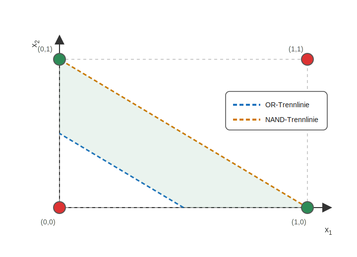

## 3.3 Aufgabe zum Netz-Aufbau (Lösung)

1) **Wie viele Neuronen sind in der versteckten Schicht?** 2 (die beiden Knoten in der mittleren Schicht).

2) **Wie viele Verbindungen (Pfeile) mit Bias führen in die versteckte Schicht hinein?** 6

    - $x_1 \rightarrow h_1$
    - $x_2 \rightarrow h_1$
    - Bias $1\rightarrow h_1$
    - $x_1 \rightarrow h_2$
    - $x_2 \rightarrow h_2$
    - Bias $1\rightarrow h_2$

3) **Wie viele Verbindungen (Pfeile) mit Bias führen in die Output-Schicht hinein?** 3

    - $h_1\rightarrow y$
    - $h_2\rightarrow y$
    - Bias $1\rightarrow y$

4) **Wie viele Gewichte gibt es insgesamt im Netz?** 9 (jede Verbindung hat ein Gewicht)

    - 6 in die versteckte Schicht + 3 in die Output-Schicht

5) **Wie viele Gewichte gibt es insgesamt, wenn man 3 Neuronen in der versteckten Schicht hätte?** 13

    - In die versteckte Schicht: $(2+1)\cdot 3 = 9$ (zwei Inputs + Bias, zu 3 Neuronen)
    - In die Output-Schicht: $(3+1) = 4$ (drei Hidden-Ausgänge + Bias, ins Output-Neuron)
    - Insgesamt: $9+4=13$

6) **Wie viele Gewichte gibt es insgesamt, wenn man $n$ Neuronen in der versteckten Schicht hätte?** $4n+1$

    - In die versteckte Schicht: $(2+1)\cdot n = 3n$
    - In die Output-Schicht: $(n+1)$
    - Insgesamt: $3n+(n+1)=4n+1$

7) **Wieso bedeutet „mehr Schichten“ nicht automatisch „besser“, wenn man keine Aktivierung dazwischen hätte?**

    Ohne Aktivierungen zwischen den Schichten könnte man alle linearen Rechnungen „zusammenfalten“.
    Das ganze Netz wäre dann am Ende wieder nur **eine** lineare Entscheidung (wie ein Perzeptron).
    Der Vorteil kommt erst durch die Nichtlinearität (Aktivierung) zwischen den Schichten.

\newpage

## 4.1 Aufgabe: XOR-Tabelle ausfüllen (Lösung)

| $x_1$ | $x_2$ | $h_1=\mathrm{OR}(x_1,x_2)$ | $h_2=\mathrm{NAND}(x_1,x_2)$ | $\hat{y}=\mathrm{AND}(h_1,h_2)$ |
|---:|---:|---:|---:|---:|
| 0 | 0 | 0 | 1 | 0 |
| 0 | 1 | 1 | 1 | 1 |
| 1 | 0 | 1 | 1 | 1 |
| 1 | 1 | 1 | 0 | 0 |

## 4.2 Visualisierung XOR-Gatter mit Trennlinien (Lösung)

1) OR-Trennlinie: so, dass (0,0) „alleine“ auf der 0-Seite liegt.

2) NAND-Trennlinie: so, dass (1,1) „alleine“ auf der 0-Seite liegt.

3) Die Schnittmenge (OR=1 **und** NAND=1) enthält genau die beiden Punkte (0,1) und (1,0).

4) Die beiden Neuronen der versteckten Schicht liefern zwei einfache „Vorfilter“ (OR und NAND).
Das Output-Neuron muss danach nur noch „beides gleichzeitig“ prüfen (AND) und bekommt damit XOR.

5) Wenn das Output statt AND ein OR wäre, dann wäre die Ausgabe für alle vier Eingaben 1:

- (0,0): OR(0,1)=1
- (0,1): OR(1,1)=1
- (1,0): OR(1,1)=1
- (1,1): OR(1,0)=1

Das wäre **kein** sinnvolles logisches Gatter (es unterscheidet die Eingaben nicht).

\newpage

## 5.1 Aufgabe: Welche Gewichte ändern sich wie? (Lösung)

Wenn $y=1$ und $\hat{y}$ zu klein ist, dann ist $y-\hat{y}>0$.

1) Dann wollen wir $\hat{y}$ erhöhen → die Output-Gewichte $v_0,v_1,v_2$ sollen (bei positiven Eingängen) eher **grösser** werden.

2) Bei gleicher Regel ändert sich das Gewicht mit dem **grösseren Eingang** stärker.
Wenn $h_1\approx 0.62$ und $h_2\approx 0.38$, dann ändert sich $v_1$ stärker als $v_2$.

3) Auch die Gewichte der versteckten Schicht werden angepasst. Dazu wird der Fehler „rückwärts“ auf die vorherige Schicht verteilt.
Gewichte, die stärker zur falschen Vorhersage beigetragen haben, werden proportional stärker korrigiert. Dies wird als Backpropagation bezeichnet.

## 5.2 Idee von Backpropagation

**Verständnisfragen (Lösung):**

1) Eingaben $x_1,x_2$ → Hidden-Aktivierungen $h_1,h_2$ → Vorhersage $\hat{y}$.
Rückwärts: der Fehler (bzw. ein Signal, das vom Fehler kommt) wird benutzt, um Gewichte zu verändern.

2) $e>0$: Vorhersage war zu klein, $\hat{y}$ soll steigen.
$e<0$: Vorhersage war zu gross, $\hat{y}$ soll sinken.

3) Wenn $e=0$, dann gibt es keinen Korrekturbedarf: die Gewichte bleiben (bei der Regel $\Delta w \propto e$) unverändert.

4) Wenn $h_1,h_2$ als Zwischenergebnisse „falsch“/nicht hilfreich sind, kann das Output-Neuron das oft nicht allein korrigieren.
Dann müssen auch die Gewichte in der versteckten Schicht so angepasst werden, dass bessere Zwischenergebnisse entstehen.

\newpage

## 5.3 Aufgabe - Fehler mehrschichtigen Netz berechnen (Lösung)

Gegeben: $y=1$, $\hat{y}\approx 0.73$.

| Grösse | Formel | Wert |
|---|---|---:|
| Fehler $e$ | $e=y-\hat{y}$ | $0.27$ |

**Verständnisfragen:**

1) $e$ ist positiv.

2) $\hat{y}$ soll beim nächsten Update steigen.

3) Angepasst werden (in dieser Übung): die Output-Gewichte $v_0,v_1,v_2$.

4) Da $e>0$ und $x_i\ge 0$ gilt, werden $v_0,v_1,v_2$ grösser.

\newpage

## 5.4 Aufgabe: Output-Gewichte updaten (Lösung)

Update-Regel:
$$
v_i^{neu}=v_i^{alt}+\eta\,e\,x_i\quad\text{mit }\eta=0.2.
$$

(Gerundet auf drei Dezimalstellen.)

| Gewicht | Eingang $x_i$ | alt | $\Delta v_i$ | neu |
|---|---:|---:|---:|---:|
| $v_0$ | 1 | 0 | $0.054$ | $0.054$ |
| $v_1$ | 0.62 | 1 | $0.033$ | $1.033$ |
| $v_2$ | 0.38 | 1 | $0.021$ | $1.021$ |

**Verständnisfragen (Lösung):**

1) $v_1$ wird stärker verändert als $v_2$, weil der Eingang grösser ist ($0.62>0.38$) und $\Delta v_i=\eta\,e\,x_i$ proportional zu $x_i$ ist.

2) Idee: Auch $w_0$ bis $w_5$ kann man so anpassen, dass die Hidden-Ausgaben $h_1,h_2$ „hilfreicher“ werden.
Dafür wird der Fehler vom Output zur versteckten Schicht zurückgegeben (Backpropagation), damit klar ist, in welche Richtung jedes Hidden-Neuron verändert werden soll.

3) Kleine Schritte machen das Lernen stabiler: zu grosse Sprünge können das Ziel übersteuern.

4) Ist $\eta$ zu gross, können die Updates zu gross werden: das Lernen schwingt/überschiesst oder wird instabil.

5) Ist $\eta$ zu klein, lernt das Netz sehr langsam (viele Updates nötig) und wirkt eventuell „wie eingefroren“.