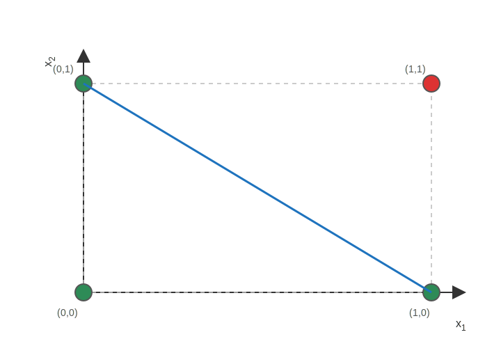
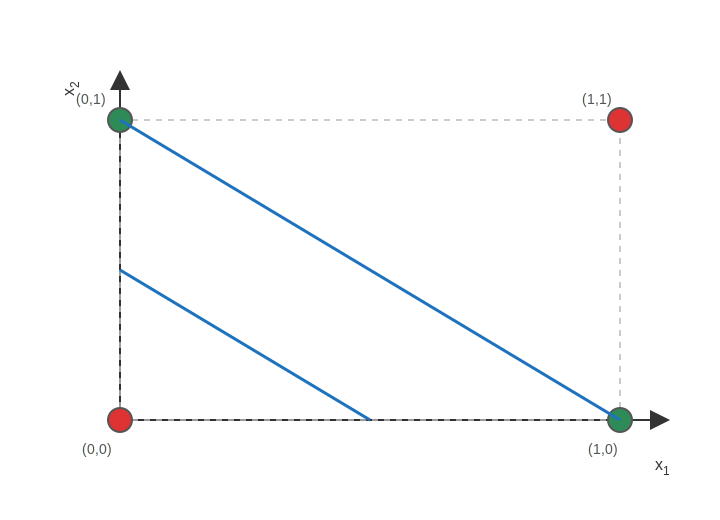

## Beispiel 1: AND-Gatter
Berechnungen mit $w_0=-0.9, w_1=0.6, w_2=0.6$.

| $x_1$ | $x_2$ | $z$ | $\hat{y}$ | $y=\hat{y}$? |
|---:|---:|---:|---:|:---:|
| 0 | 0 | -0.9 | 0 | Ja |
| 0 | 1 | -0.3 | 0 | Ja |
| 1 | 0 | -0.3 | 0 | Ja |
| 1 | 1 | 0.3 | 1 | Ja |

**Trennlinie (einfach zeichnen)**
- Umstellen auf $x_2$: $-0.9 + 0.6 x_1 + 0.6 x_2 = 0 \Rightarrow x_2 = 1.5 - x_1$.
- Zwei Punkte setzen: $(0,1.5)$ und $(1.5,0)$ verbinden.
- Check: Nur (1,1) ist auf der 1-Seite, alle anderen auf 0-Seite.

\newpage

## Beispiel 2: OR-Gatter
Berechnungen mit $w_0=-0.2, w_1=0.6, w_2=0.6$.

| $x_1$ | $x_2$ | $z$ | $\hat{y}$ | $y=\hat{y}$? |
|---:|---:|---:|---:|:---:|
| 0 | 0 | -0.2 | 0 | Ja |
| 0 | 1 | 0.4 | 1 | Ja |
| 1 | 0 | 0.4 | 1 | Ja |
| 1 | 1 | 1.0 | 1 | Ja |

**Trennlinie (einfach zeichnen)**
- Umstellen auf $x_2$: $-0.2 + 0.6 x_1 + 0.6 x_2 = 0 \Rightarrow x_2 \approx 0.33 - x_1$.
- Zwei Punkte setzen: $(0,0.33)$ und $(0.33,0)$ verbinden.
- Check: Nur (0,0) bleibt auf 0-Seite, die übrigen Punkte auf 1-Seite.

\newpage

# Beispiel 3: Perzeptron trainieren (NAND)
Startgewichte $w_0=w_1=w_2=0.1$, Lernrate $\eta=0.2$.

## Aufgabe 3a: Vorhersage und Fehler

| $x_1$ | $x_2$ | $z$ | $\hat{y}$ | $y=\hat{y}$? |
|---:|---:|---:|---:|:---:|
| 0 | 0 | 0.1 | 1 | Ja |
| 0 | 1 | 0.2 | 1 | Ja |
| 1 | 0 | 0.2 | 1 | Ja |
| 1 | 1 | 0.3 | 1 | Nein |

Nach Update 1 (Gewichte $w_0=w_1=w_2=-0.1$):

| $x_1$ | $x_2$ | $z$ | $y=\hat{y}$? (Ja/Nein) |
|---:|---:|---:|:---:|
| 0 | 0 | -0.1 | Nein |
| 0 | 1 | -0.2 | Nein |
| 1 | 0 | -0.2 | Nein |
| 1 | 1 | -0.3 | Ja |

Nach Update 2 (Gewichte $w_0=0.1, w_1=-0.1, w_2=-0.1$):

| $x_1$ | $x_2$ | $z$ | $y=\hat{y}$? (Ja/Nein) |
|---:|---:|---:|:---:|
| 0 | 0 | 0.1 | Ja |
| 0 | 1 | 0.0 | Ja |
| 1 | 0 | 0.0 | Ja |
| 1 | 1 | -0.1 | Ja |

## Aufgabe 3b: Gewichte aktualisieren
Fehler beim ersten falschen Beispiel $(1,1)$: $y-\hat{y} = -1$.

**Update 1** (nutzt $(1,1)$):

| Gewicht | Alter Wert | $y-\hat{y}$ | Neues $w$ |
|---|---:|---:|---:|
| $w_0$ | 0.1 | -1 | -0.1 |
| $w_1$ | 0.1 | -1 | -0.1 |
| $w_2$ | 0.1 | -1 | -0.1 |

Prüfe erneut: erstes falsches Beispiel nun $(0,0)$ mit $y-\hat{y}=1$.

Überprüfung nach Update 1 (neue Gewichte $w_0=w_1=w_2=-0.1$):

| $x_1$ | $x_2$ | $z$ | $y=\hat{y}$? (Ja/Nein) |
|---:|---:|---:|:---:|
| 0 | 0 | -0.1 | Nein |
| 0 | 1 | -0.2 | Nein |
| 1 | 0 | -0.2 | Nein |
| 1 | 1 | -0.3 | Ja |

**Update 2** (nutzt $(0,0)$):

| Gewicht | Alter Wert | $y-\hat{y}$ | Neues $w$ |
|---|---:|---:|---:|
| $w_0$ | -0.1 | 1 | 0.1 |
| $w_1$ | -0.1 | 1 | -0.1 |
| $w_2$ | -0.1 | 1 | -0.1 |

Überprüfung nach Update 2 (Gewichte $w_0=0.1, w_1=-0.1, w_2=-0.1$):

| $x_1$ | $x_2$ | $z$ | $y=\hat{y}$? (Ja/Nein) |
|---:|---:|---:|:---:|
| 0 | 0 | 0.1 | Ja |
| 0 | 1 | 0.0 | Ja |
| 1 | 0 | 0.0 | Ja |
| 1 | 1 | -0.1 | Ja |

\newpage

## Aufgabe 3c: Visualisierung (NAND)
Färbung der Punkte nach NAND-Wahrheitstafel: $y=1$ grün, $y=0$ rot und Trennlinien nach dem zweiten Update. Der erste Update trennt nicht korrekt, daher nur die zweite Linie hier gezeigt.

\newpage

# Aufgabe 4: XOR-Visualisierung
- Keine einzelne Gerade kann diese vier Punkte trennen (nicht linear separierbar). Zwei Geraden sind nötig. Das bedeutet, dass ein einfaches Perzeptron das XOR-Gatter nicht lösen kann. Dafür sind mindestens zwei Schichten (z.B. ein mehrschichtiges Perzeptron) erforderlich.

