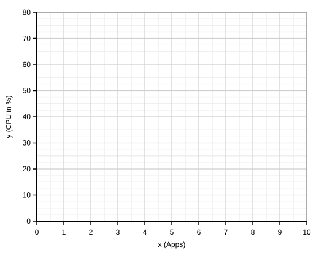
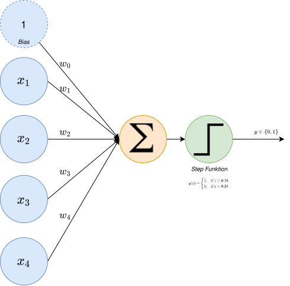
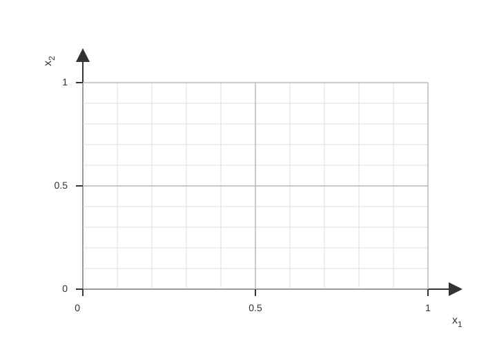

```{=latex}
\begin{center}
\renewcommand{\arraystretch}{1.7}

\begin{tabular}{|>{\centering\arraybackslash}m{7cm}|>{\centering\arraybackslash}m{2.5cm}|>{\centering\arraybackslash}m{2.5cm}|>{\centering\arraybackslash}m{2.5cm}|}
\hline
								\textbf{Name} & \textbf{Datum} & \textbf{Zeit} & \textbf{max. Punkte} \\
\hline
\rule{0pt}{2.2em} & 22.01.26 & 50 min & 40 \\
\hline
\end{tabular}

\vspace{2cm}

\begin{tabular}{|>{\centering\arraybackslash}m{5.2cm}|>{\centering\arraybackslash}m{2.6cm}|>{\centering\arraybackslash}m{2.9cm}|}
\hline
					\multicolumn{1}{|>{\centering\arraybackslash}m{5.2cm}|}{\textbf{Teilbereich}} & \textbf{max. Punkte} & \textbf{Erreichte Punkte} \\
\hline
\rule[-1.1em]{0pt}{2.2em}A: Multiple Choice & 8 & \\
\hline
\rule[-1.1em]{0pt}{2.2em}B: Lineare Regression & 12 & \\
\hline
\rule[-1.1em]{0pt}{2.2em}C: Logistische Regression & 10 & \\
\hline
\rule[-1.1em]{0pt}{2.2em}D: Perzeptron & 10 & \\
\hline
\rule[-1.1em]{0pt}{2.2em}\textbf{Gesamt} & \textbf{40} & \\
\hline
\end{tabular}


\end{center}
```
\vspace{2cm}

**Erlaubte Hilfsmittel:** 

- nicht-programmierbarer Taschenrechner
- Lineal

\newpage
## Teil A: Multiple Choice [8 Punkte]
Wähle pro Aussage die korrekte Antwort aus (richtig oder falsch). Jede Aussage ist gleich gewichtet und gibt 0.5 Punkte.

1. Einordnung: Welche Aussagen zur Einteilung von KI, Machine Learning und Deep Learning stimmen? [2P]

```{=latex}
\begingroup
\normalsize
\setlength{\tabcolsep}{0pt}
```

\begin{tabular}{@{}p{\dimexpr\linewidth-2.4cm-10pt\relax}@{\hspace{5pt}}>{\centering\arraybackslash}m{1.2cm}@{\hspace{5pt}}>{\centering\arraybackslash}m{1.2cm}@{}}
\hline
Aussage & richtig & falsch \\
\hline
Deep Learning ist eine Teilmenge von Machine Learning. & $\square$ & $\square$ \\
Machine Learning wird immer mit neuronalen Netzen umgesetzt. & $\square$ & $\square$ \\
Zur KI zählen auch regelbasierte Expertensysteme ohne Lernen. & $\square$ & $\square$ \\
Ein KI-System funktioniert nur, wenn es zuvor mit Trainingsdaten trainiert wurde. & $\square$ & $\square$ \\
\hline
\end{tabular}

```{=latex}
\endgroup
```

\vspace{0.6cm}

2. Systeme: Welche Aussagen treffen auf wissensbasierte vs. lernende Systeme zu? [1P]

```{=latex}
\begingroup
\normalsize
\setlength{\tabcolsep}{0pt}
```

\begin{tabular}{@{}p{\dimexpr\linewidth-2.4cm-10pt\relax}@{\hspace{5pt}}>{\centering\arraybackslash}m{1.2cm}@{\hspace{5pt}}>{\centering\arraybackslash}m{1.2cm}@{}}
\hline
Aussage & richtig & falsch \\
\hline
Wissensbasierte Systeme nutzen Regeln/Expertenwissen statt (Daten-)Training. & $\square$ & $\square$ \\
Ein lernendes System braucht immer gelabelte Trainingsdaten. & $\square$ & $\square$ \\
\hline
\end{tabular}

```{=latex}
\endgroup
```

\vspace{0.6cm}

3. Stufen der KI: Welche Aussagen sind korrekt? [2P]

```{=latex}
\begingroup
\normalsize
\setlength{\tabcolsep}{0pt}
```

\begin{tabular}{@{}p{\dimexpr\linewidth-2.4cm-10pt\relax}@{\hspace{5pt}}>{\centering\arraybackslash}m{1.2cm}@{\hspace{5pt}}>{\centering\arraybackslash}m{1.2cm}@{}}
\hline
Aussage & richtig & falsch \\
\hline
Reaktive KI reagiert nur auf den aktuellen Zustand und speichert keine Vergangenheit. & $\square$ & $\square$ \\
„Begrenzte Speicherkapazität“ nutzt vergangene Beobachtungen. & $\square$ & $\square$ \\
„Theorie des Geistes“ beschreibt KI, die Absichten/Emotionen anderer modellieren kann. & $\square$ & $\square$ \\
„Selbstwahrnehmung“ ist heute in typischen Alltagsanwendungen Standard. & $\square$ & $\square$ \\
\hline
\end{tabular}

```{=latex}
\endgroup
```

\vspace{0.6cm}

4. Turing-Test: Welche Aussagen stimmen? [2P]

```{=latex}
\begingroup
\normalsize
\setlength{\tabcolsep}{0pt}
```

\begin{tabular}{@{}p{\dimexpr\linewidth-2.4cm-10pt\relax}@{\hspace{5pt}}>{\centering\arraybackslash}m{1.2cm}@{\hspace{5pt}}>{\centering\arraybackslash}m{1.2cm}@{}}
\hline
Aussage & richtig & falsch \\
\hline
Der Turing-Test misst nicht zwingend Bewusstsein, sondern Ununterscheidbarkeit im Gespräch. & $\square$ & $\square$ \\
Der Turing-Test misst vor allem mathematische Rechenleistung. & $\square$ & $\square$ \\
Den Turing-Test bestehen heisst nicht, dass das System Emotionen hat. & $\square$ & $\square$ \\
Der Turing-Test kann auch als reiner Text-Chat durchgeführt werden. & $\square$ & $\square$ \\
\hline
\end{tabular}

```{=latex}
\endgroup
```

\vspace{0.6cm}

5. Lernarten: Welche Aussagen stimmen? [1P]

```{=latex}
\begingroup
\normalsize
\setlength{\tabcolsep}{0pt}
```

\begin{tabular}{@{}p{\dimexpr\linewidth-2.4cm-10pt\relax}@{\hspace{5pt}}>{\centering\arraybackslash}m{1.2cm}@{\hspace{5pt}}>{\centering\arraybackslash}m{1.2cm}@{}}
\hline
Aussage & richtig & falsch \\
\hline
Beim Reinforcement Learning lernt man über Belohnung. & $\square$ & $\square$ \\
Beim Unsupervised Learning sind die Labels („richtige Antworten“) von Anfang an vorgegeben. & $\square$ & $\square$ \\
\hline
\end{tabular}

```{=latex}
\endgroup
```

\newpage
## Teil B: Lineare Regression [12 Punkte]

**B1 – Mean Squared Error (MSE) [7 Punkte]**  

**Anwendungsfall:** Ein Smartphone wird für Video-Streaming genutzt. $x$ ist die Nutzungsdauer in Stunden, $y$ ist der verbleibende Akkustand in Prozent. Anhand von bestehenden Daten wurde ein lineares Modell trainiert und lautet: $\hat{y}=-10x+80$. Nun soll das Modell evaluiert werden. Neue Datenpunkte sind gegeben: $(x,y)$: (0,79), (1,68), (2,63), (3,47), (4,41), (5,28).

 a) Trage $\hat{y}$, Residuen und Quadrate in die Tabelle ein. [3 Punkte]

| $x$ | $y$ | $\hat{y}$ | $y-\hat{y}$ | $(y-\hat{y})^2$ |
|---:|---:|---:|---:|---:|
| 0 | 79 |  |  |  |
| 1 | 68 |  |  |  |
| 2 | 63 |  |  |  |
| 3 | 47 |  |  |  |
| 4 | 41 |  |  |  |
| 5 | 28 |  |  |  |

 b) Berechne den Mean Squared Error (MSE) des Modells. [2 Punkte]

 > **MSE =**

\vspace{5cm}

 c) Interpretation (1–2 Sätze): Was sagt der Mean Squared Error (MSE) über die Qualität des Modells bzw. die Passung an die Daten aus? Beziehe dich kurz auf den Akkustand-Anwendungsfall. [1 Punkt]

\vspace{3cm}

 d) Erkläre, warum dieses Modell in der Praxis evtl. nicht ideal sein könnte (1–2 Sätze). [1 Punkt]

\newpage

**B2 – Zwei Regressionsmodelle vergleichen [5 Punkte]**  

**Anwendungsfall:** Ein lineares Modell soll grob die CPU-Auslastung eines Laptops vorhersagen. $x$ ist die Anzahl gleichzeitig laufender Applikationen, $y$ ist die CPU-Auslastung in Prozent. Es wurden zwei lineare Modelle trainiert: $\hat{y}_A=8x+35$ und $\hat{y}_B=10x+30$. Nun sollen die Modelle anhand neuer Daten evaluiert werden. Folgende 6 Datenpunkte sind gegeben: $(x,y)$: (0,20), (1,37), (2,46), (3,62), (4,69), (5,77).  

 a) Zeichne beide Modelle und die Datenpunkte in ein gemeinsames Koordinatensystem. [3 Punkte]



\vspace{0.5cm}

 b) Bestimme qualitativ (ohne Berechnung), welches Modell besser zu den Daten passt, und begründe knapp. [1 Punkt]


 \vspace{2cm}


 c) Welche Modell-Eigenschaft würdest du eher anpassen, um jeweils Modell A und B zu verbessern: Steigung und/oder $y$-Achsenabschnitt? Begründe kurz. [1 Punkt]

\newpage

## Teil C: Logistische Regression [10 Punkte]

**C1 – Wahrscheinlichkeiten & Accuracy [6 Punkte]**  

**Anwendungsfall:** Ein System soll entscheiden, ob ein:e Kund:in ein Produkt aus einem Online-Shop "kauft" (1) oder "nicht kauft" (0). $x$ ist ein Score aus dem Onlineshop. Die Kaufwahrscheinlichkeit steigt, je höher der Score ist. Anhand von Trainingsdaten wurde ein logistisches Regressionsmodell erstellt: $p=\sigma(1.5x-2.2)$, wobei $\sigma(z)=\frac{1}{1+e^{-z}}$ die Sigmoid-Funktion ist. Die Entscheidungsgrenze (Schwelle) wurde auf 0.5 gesetzt. Das Modell soll nun mit neuen Datenpunkten validiert werden. Folgende neue Datenpunkte sind gegeben: $(x,y)$: (0.8,0), (1.2,0), (1.8,0), (2.2,1), (2.8,1), (3.2,1).  

 a) Berechne $z$, $p$ (auf 3 Dezimalstellen gerundet) und $\hat{y}$. [3 Punkte]

```{=latex}
\begingroup
\setlength{\tabcolsep}{4pt}
\renewcommand{\arraystretch}{1.3}
\noindent\hspace*{1.5em}%
\begin{tabular}{>{\centering\arraybackslash}m{1.0cm} >{\centering\arraybackslash}m{1.0cm} >{\centering\arraybackslash}m{3.4cm} >{\centering\arraybackslash}m{3.0cm} >{\centering\arraybackslash}m{3.8cm}}
\hline
$x$ & $y$ & $z = 1.5x - 2.2$ & $p = \sigma(z)$ & $\hat{y}$ (Schwelle 0.5) \\
\hline
0.8 & 0 &  &  &  \\
1.2 & 0 &  &  &  \\
1.8 & 0 &  &  &  \\
2.2 & 1 &  &  &  \\
2.8 & 1 &  &  &  \\
3.2 & 1 &  &  &  \\
\hline
\end{tabular}
\endgroup
```

\vspace{1cm}

 b) Berechne die Accuracy für die Vorhersagen in a). [1 Punkt]

 > **Accuracy =**

\vspace{5cm}

 c) Interpretation (1–2 Sätze): Was sagt die Accuracy über die Qualität des Modells im Anwendungsfall aus? [1 Punkt]

\vspace{2cm}

 d) Welche Parameter des Modells werden beim Training angepasst, um die Vorhersagen zu verbessern? Nenne zwei. [1 Punkt]

 \vspace{2cm}

\newpage

**C2 – Schwelle interpretieren [4 Punkte]** 

**Anwendungsfall:** Ein Alarmanlagensystem soll ab einer bestimmten Wahrscheinlichkeit einen "Alarm" auslösen. Bei einem Wert von 1 wird ein Alarm ausgelöst, bei 0 nicht. Ein bereits gelerntes logistisches Regressionsmodell liefert für sechs Fälle Wahrscheinlichkeiten $p$: 0.12, 0.28, 0.49, 0.55, 0.73, 0.91.

 a) Berechne $\hat{y}$ bei Schwelle 0.5. [1 Punkt]

| $p$ | $\hat{y}$ (Schwelle 0.5) |
|---:|:--:|
| 0.12 |  |
| 0.28 |  |
| 0.49 |  |
| 0.55 |  |
| 0.73 |  |
| 0.91 |  |

\vspace{1cm}

 b) Was passiert, wenn man die Schwelle auf 0.7 anhebt? Nenne eine konkrete Änderung bei den obigen $p$-Werten. [1 Punkt]

\vspace{3cm}

 c) Nenne einen Grund, warum man die Schwelle erhöhen oder senken würde. [1 Punkt]

\vspace{2cm}

 d) Nenne einen Nachteil, der entstehen kann, wenn die Schwelle zu niedrig oder zu hoch gesetzt wird. [1 Punkt]

\vspace{2cm}

\newpage

## Teil D: Perzeptron [10 Punkte]

**D1 – Vorwärtsdurchlauf & Trennlinie [10 Punkte]**

**Anwendungsfall:** Ein sehr einfaches Zugangssystem entscheidet: "Zutritt" (1) oder "kein Zutritt" (0). Die Eingaben $x_1$ bis $x_4$ sind vier Sensorwerte zwischen 0 und 1. Die Sensorwerte werden mit Gewichten $w_1$ bis $w_4$ multipliziert und mit einem Bias $w_0$ summiert. Das Ergebnis $z$ wird durch eine Step-Aktivierungsfunktion in die Vorhersage $\hat{y}$ umgewandelt. Es gilt: $\hat{y}=1$ falls $z\ge 0.28$, sonst $\hat{y}=0$. Das Netzwerk ist in der folgenden Abbildung 2 dargestellt:



\newpage

Das Netzwerk hat durch das Training bereits folgende Gewichte gelernt: $w_0=-1.0$, $w_1=1.2$, $w_2=0.6$, $w_3=-0.4$, $w_4=0.8$ und soll nun für nachfolgende Eingaben die Ausgabe vorhersagen.

 a) Berechne $z$ und $\hat{y}$ für folgende Eingaben. [4 Punkte]

| $x_1$ | $x_2$ | $x_3$ | $x_4$ | $z$ | $\hat{y}$ |
|---:|---:|---:|---:|---:|:--:|
| 0.2 | 0.1 | 0.9 | 0.2 |  |  |
| 0.6 | 0.4 | 0.2 | 0.7 |  |  |
| 0.8 | 0.9 | 0.1 | 0.9 |  |  |
| 0.9 | 0.6 | 0.8 | 0.1 |  |  |

\vspace{3cm}

 b) Betrachte den Schnitt $x_3=0.5$ und $x_4=0.5$. Leite die Gleichung der Trennlinie in der $x_1$-$x_2$-Ebene her: Setze $z=0.28$ und forme nach $x_2$ um ($x_2 = ax_1+b$). [2 Punkte]

 > **Erklärung:** Ein Modell mit vier Eingaben hat seine Entscheidungsgrenze im 4D-Raum und kann nicht direkt in ein 2D-Koordinatensystem gezeichnet werden. Deshalb fixieren wir hier $x_3$ und $x_4$ auf feste Werte und betrachten nur den 2D-Schnitt in der $x_1$-$x_2$-Ebene. In einem anderen Schnitt (mit anderen festen $x_3$, $x_4$) kann die Trennlinie verschoben sein.
 
 > **Hinweis:** In diesem Schnitt vereinfacht sich die Summe zu $z=-0.8+1.2x_1+0.6x_2$.

\vspace{3cm}

 c) Zeichne die Gerade aus b) in das Koordinatensystem ein. Markiere anschliessend die Punkte $P=(0.2,0.1)$ und $Q=(0.8,0.9)$ und gib ihre Vorhersage an (verwende dabei ebenfalls $x_3=0.5$ und $x_4=0.5$ und vergleiche $z$ mit $0.28$). [2 Punkte]

\vspace{3cm}



 d) Erkläre kurz (1–2 Sätze), wie eine Änderung von $w_0$ (Bias) die Trennlinie verschiebt und was das im Zugangssystem konkret bedeutet. [2 Punkte]

\vspace{3cm}
