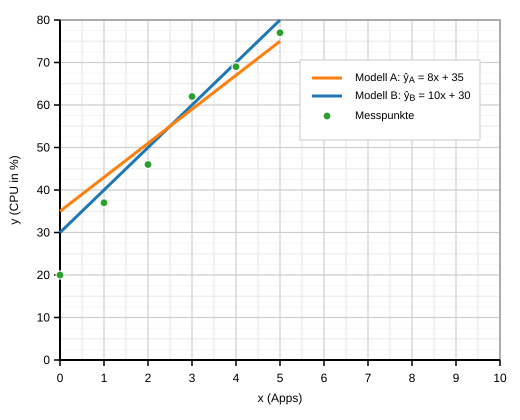
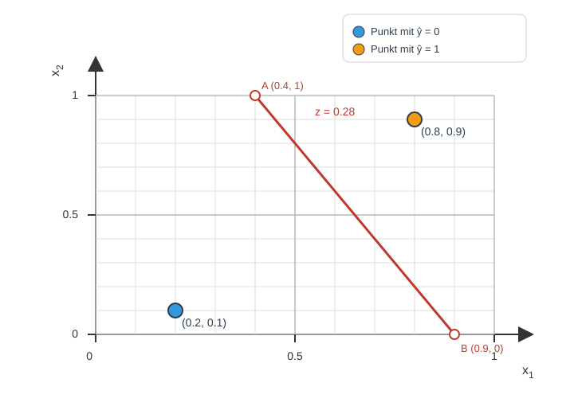

\newpage
## Teil A: Multiple Choice
1. Einordnung: Welche Aussagen zur Einteilung von KI, Machine Learning (ML) und Deep Learning (DL) stimmen?

```{=latex}
\begingroup
\small
\setlength{\tabcolsep}{4pt}
```

\begin{tabular}{p{14cm}cc}
\hline
Aussage & richtig & falsch \\
\hline
Deep Learning ist eine Teilmenge von Machine Learning. & $\boxtimes$ & $\square$ \\
Machine Learning wird immer mit neuronalen Netzen umgesetzt. & $\square$ & $\boxtimes$ \\
Zur KI zählen auch regelbasierte Expertensysteme ohne Lernen. & $\boxtimes$ & $\square$ \\
Ein KI-System funktioniert nur, wenn es zuvor mit Trainingsdaten trainiert wurde. & $\square$ & $\boxtimes$ \\
\hline
\end{tabular}

```{=latex}
\endgroup
```

2. Systeme: Welche Aussagen treffen auf wissensbasierte vs. lernende Systeme zu? (1P)

```{=latex}
\begingroup
\small
\setlength{\tabcolsep}{4pt}
```

\begin{tabular}{p{14cm}cc}
\hline
Aussage & richtig & falsch \\
\hline
Wissensbasierte Systeme nutzen Regeln/Expertenwissen statt (Daten-)Training. & $\boxtimes$ & $\square$ \\
Damit ein System lernen kann, braucht es immer gelabelte Trainingsdaten. & $\square$ & $\boxtimes$ \\
\hline
\end{tabular}

```{=latex}
\endgroup
```

3. Stufen der KI: Welche Aussagen sind korrekt? (2P)

```{=latex}
\begingroup
\small
\setlength{\tabcolsep}{4pt}
```

\begin{tabular}{p{14cm}cc}
\hline
Aussage & richtig & falsch \\
\hline
Reaktive KI reagiert nur auf den aktuellen Zustand und speichert keine Vergangenheit. & $\boxtimes$ & $\square$ \\
"Limited Memory" nutzt vergangene Beobachtungen, aber nur in begrenztem Umfang. & $\boxtimes$ & $\square$ \\
"Theory of Mind" beschreibt KI, die Absichten/Emotionen anderer modellieren kann. & $\boxtimes$ & $\square$ \\
"Self-Aware" (Selbstwahrnehmung) ist heute in typischen Alltagsanwendungen Standard. & $\square$ & $\boxtimes$ \\
\hline
\end{tabular}

```{=latex}
\endgroup
```

4. Turing-Test: Welche Aussagen stimmen? (2P)

```{=latex}
\begingroup
\small
\setlength{\tabcolsep}{4pt}
```

\begin{tabular}{p{14cm}cc}
\hline
Aussage & richtig & falsch \\
\hline
Turing-Test: Ununterscheidbarkeit im Gespräch, nicht zwingend Bewusstsein. & $\boxtimes$ & $\square$ \\
Der Turing-Test misst vor allem mathematische Rechenleistung. & $\square$ & $\boxtimes$ \\
Turing bestehen heisst nicht, dass das System Emotionen hat. & $\boxtimes$ & $\square$ \\
Der Turing-Test kann auch als reiner Text-Chat durchgeführt werden. & $\boxtimes$ & $\square$ \\
\hline
\end{tabular}

```{=latex}
\endgroup
```

5. Lernarten: Welche Aussagen stimmen? (1P)

```{=latex}
\begingroup
\small
\setlength{\tabcolsep}{4pt}
```

\begin{tabular}{p{14cm}cc}
\hline
Aussage & richtig & falsch \\
\hline
Beim Reinforcement Learning lernt man über Belohnung, z.B. Punkte für gefundene Paare. & $\boxtimes$ & $\square$ \\
Beim Unsupervised Learning sind die Labels ("richtige Antworten") von Anfang an vorgegeben. & $\square$ & $\boxtimes$ \\
\hline
\end{tabular}

```{=latex}
\endgroup
```


\newpage
## Teil B: Lineare Regression

**B1** Gegeben: $\hat{y}=-10x+80$ und Punkte $(x,y)$: (0,79), (1,68), (2,63), (3,47), (4,41), (5,28).

| $x$ | $y$ | $\hat{y}$ | $y-\hat{y}$ | $(y-\hat{y})^2$ |
|---:|---:|---:|---:|---:|
| 0 | 79 | 80 | -1 | 1 |
| 1 | 68 | 70 | -2 | 4 |
| 2 | 63 | 60 | 3 | 9 |
| 3 | 47 | 50 | -3 | 9 |
| 4 | 41 | 40 | 1 | 1 |
| 5 | 28 | 30 | -2 | 4 |

Summe Quadrate $=28$  \
Mean Squared Error (MSE) $=\frac{28}{6}\approx4.67$

Interpretation (qualitativ): Je kleiner der MSE, desto besser passt das Modell zu den Daten (kleinere Fehler). Durch das Quadrieren werden grössere Abweichungen stärker bestraft.

**B1d** (Musterlösung, 1–2 Sätze): Das lineare Modell ist in der Praxis evtl. nicht ideal, weil der Akkustand nicht perfekt linear abnimmt (z.B. wechselnde Displayhelligkeit, Funkempfang, Hintergrundprozesse, Temperatur). Ausserdem kann das Modell fuer grosse $x$ ungueltige Werte vorhersagen (unter 0\%), obwohl der Akkustand nicht negativ werden kann.

**B2** Daten: $(x,y)$: (0,20), (1,37), (2,46), (3,62), (4,69), (5,77). Modelle: $\hat{y}_A=8x+35$, $\hat{y}_B=10x+30$.

| $x$ | $y$ | $\hat{y}_A$ | $y-\hat{y}_A$ | $(y-\hat{y}_A)^2$ | $\hat{y}_B$ | $y-\hat{y}_B$ | $(y-\hat{y}_B)^2$ |
|---:|---:|---:|---:|---:|---:|---:|---:|
| 0 | 20 | 35 | -15 | 225 | 30 | -10 | 100 |
| 1 | 37 | 43 | -6 | 36 | 40 | -3 | 9 |
| 2 | 46 | 51 | -5 | 25 | 50 | -4 | 16 |
| 3 | 62 | 59 | 3 | 9 | 60 | 2 | 4 |
| 4 | 69 | 67 | 2 | 4 | 70 | -1 | 1 |
| 5 | 77 | 75 | 2 | 4 | 80 | -3 | 9 |

| Modell | Summe Quadrate | MSE |
|:--|---:|---:|
| A | 303 | $\frac{303}{6}=50.5$ |
| B | 139 | $\frac{139}{6}\approx23.17$ |

Fazit: Modell B hat den kleineren MSE und passt besser.

**B2b** (qualitativ, Musterlösung): Modell B passt besser, weil seine Gerade die Punktwolke insgesamt näher trifft (insbesondere bei kleinen $x$ ist Modell A deutlich zu hoch; Modell B liegt näher am Punkt (0,20) und verläuft insgesamt mittiger durch die Daten).

c) Qualitativ (an $x=0$ und $x=5$ ablesen):
- Bei $x=0$: $\hat{y}_A=35$ und $\hat{y}_B=30$ liegen beide ueber $y=20$ (zu hoch) $\Rightarrow$ Achsenabschnitt ist bei beiden eher zu gross.
- Bei $x=5$: $\hat{y}_A=75$ liegt leicht unter $y=77$ (zu niedrig), $\hat{y}_B=80$ liegt ueber $y=77$ (zu hoch).

Interpretation/Verbesserung (Beispielantwort):
- Modell A: Start zu hoch, am Ende leicht zu niedrig $\Rightarrow$ Achsenabschnitt senken und/oder Steigung etwas erhöhen.
- Modell B: Start zu hoch und am Ende noch zu hoch $\Rightarrow$ eher Achsenabschnitt senken (Steigung passt tendenziell besser).

{ width=80% }


\newpage
## Teil C: Logistische Regression

**C1** Modell: $p=\sigma(1.5x-2.2)$, Schwelle 0.5.

| $x$ | $y$ | $z=1.5x-2.2$ | $p=\sigma(z)$ | $\hat{y}$ |
|---:|---:|---:|---:|---:|
| 0.8 | 0 | -1.00 | 0.269 | 0 |
| 1.2 | 0 | -0.40 | 0.401 | 0 |
| 1.8 | 0 | 0.50 | 0.622 | 1 |
| 2.2 | 1 | 1.10 | 0.750 | 1 |
| 2.8 | 1 | 2.00 | 0.881 | 1 |
| 3.2 | 1 | 2.60 | 0.931 | 1 |

Accuracy $=5/6\approx0.833$ (ein Fehler bei $x=1.8$). Bedeutung: Anteil der Fälle, die im Anwendungsfall ("kauft"/"kauft nicht") korrekt vorhergesagt wurden.

**C1d** (Musterlösung): Beim Training werden die Modellparameter angepasst, z.B. der Koeffizient vor $x$ (hier: 1.5) und der Bias/Offset (hier: -2.2). Allgemein: Gewichte/Koeffizienten und Bias.

**C2**

| $p$ | $\hat{y}$ (Schwelle 0.5) | $\hat{y}$ (Schwelle 0.7) |
|---:|---:|---:|
| 0.12 | 0 | 0 |
| 0.28 | 0 | 0 |
| 0.49 | 0 | 0 |
| 0.55 | 1 | 0 |
| 0.73 | 1 | 1 |
| 0.91 | 1 | 1 |

Konkrete Änderung beim Anheben auf 0.7: $p=0.55$ wechselt von 1 auf 0 (wird nicht mehr als Alarm gewertet). Höhere Schwelle = strenger (weniger 1), niedrigere Schwelle = weniger streng (mehr 1).

**C2c** (Musterlösung): Man erhoeht die Schwelle, wenn False Positives (falscher Alarm) besonders teuer/stoerend sind (z.B. unnötige Einsätze). Man senkt die Schwelle, wenn man moeglichst keine echten Ereignisse verpassen will (z.B. Sicherheits-/Gesundheitsbereich).

**C2d** (Musterlösung): Zu niedrige Schwelle $\Rightarrow$ viele False Positives (zu viele Alarme, Kosten, Alarmmuedigkeit). Zu hohe Schwelle $\Rightarrow$ mehr False Negatives (echte Ereignisse werden uebersehen).


\newpage
## Teil D: Perzeptron

**D1a** $z=w_0+w_1x_1+w_2x_2+w_3x_3+w_4x_4=-1+1.2x_1+0.6x_2-0.4x_3+0.8x_4$.

| $x_1$ | $x_2$ | $x_3$ | $x_4$ | $z$ | $\hat{y}$ |
|---:|---:|---:|---:|---:|:--:|
| 0.2 | 0.1 | 0.9 | 0.2 | -0.90 | 0 |
| 0.6 | 0.4 | 0.2 | 0.7 | 0.44 | 1 |
| 0.8 | 0.9 | 0.1 | 0.9 | 1.18 | 1 |
| 0.9 | 0.6 | 0.8 | 0.1 | 0.20 | 0 |

**D1b** Schnitt $x_3=0.5$, $x_4=0.5$:  
$0.28=-1+1.2x_1+0.6x_2-0.4\cdot0.5+0.8\cdot0.5$  
$\Rightarrow 0.28=-0.8+1.2x_1+0.6x_2$  
$\Rightarrow x_2=\frac{1.08-1.2x_1}{0.6}=1.8-2x_1$.

Zum Zeichnen (im Bereich $0\le x_1,x_2\le 1$): Bestimme zwei Punkte auf der Geraden und verbinde sie.

Praktisch nimmt man die Schnittpunkte mit den Rändern:
- Setze $x_2=1$: $1=1.8-2x_1\Rightarrow x_1=0.4$  $\Rightarrow A=(0.4,1)$.
- Setze $x_2=0$: $0=1.8-2x_1\Rightarrow x_1=0.9$  $\Rightarrow B=(0.9,0)$.

Diese beiden Punkte $A$ und $B$ einzeichnen und eine Gerade durch $A$ und $B$ ziehen.

**D1c** (mit $x_3=0.5$, $x_4=0.5$, Schwelle $z\ge 0.28$):
- Punkt $P=(0.2,0.1)$: $z=-0.8+1.2\cdot0.2+0.6\cdot0.1=-0.50<0.28\Rightarrow \hat{y}=0$.
- Punkt $Q=(0.8,0.9)$: $z=-0.8+1.2\cdot0.8+0.6\cdot0.9=0.70\ge0.28\Rightarrow \hat{y}=1$.

**D1d** Idee: $w_0$ steuert die "Grundtendenz" Richtung 0/1 und verschiebt die Entscheidungsgrenze (bei fixem Schnitt) parallel.

| Änderung | Effekt auf Entscheidung | Bedeutung im Zugangssystem |
|:--|:--|:--|
| $w_0$ grösser (weniger negativ) | leichter $\hat{y}=1$ | Zutritt wird grosszügiger |
| $w_0$ kleiner (mehr negativ) | schwerer $\hat{y}=1$ | Zutritt wird strenger |

{ width=80% }
